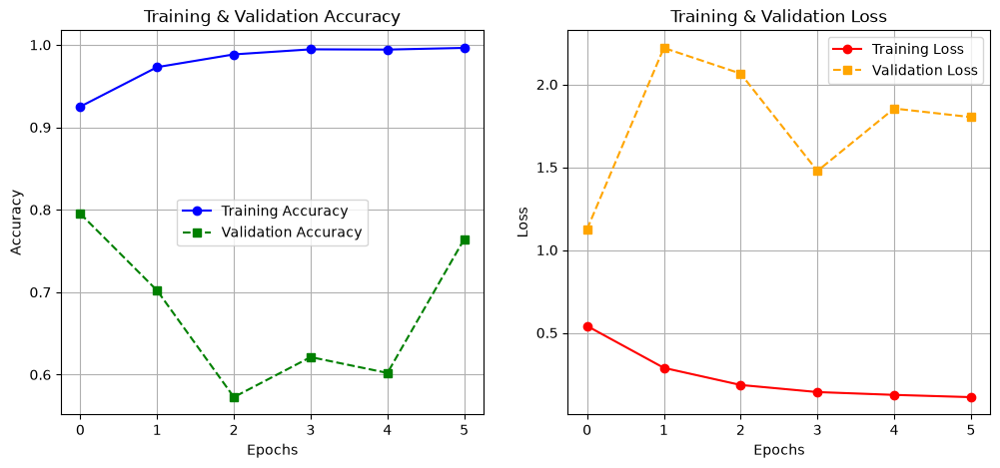
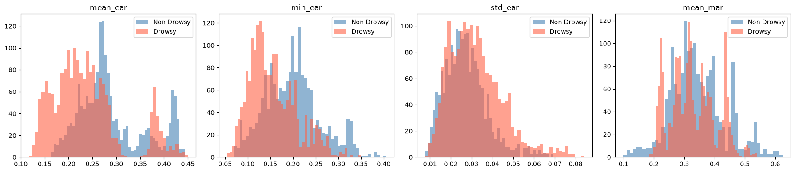
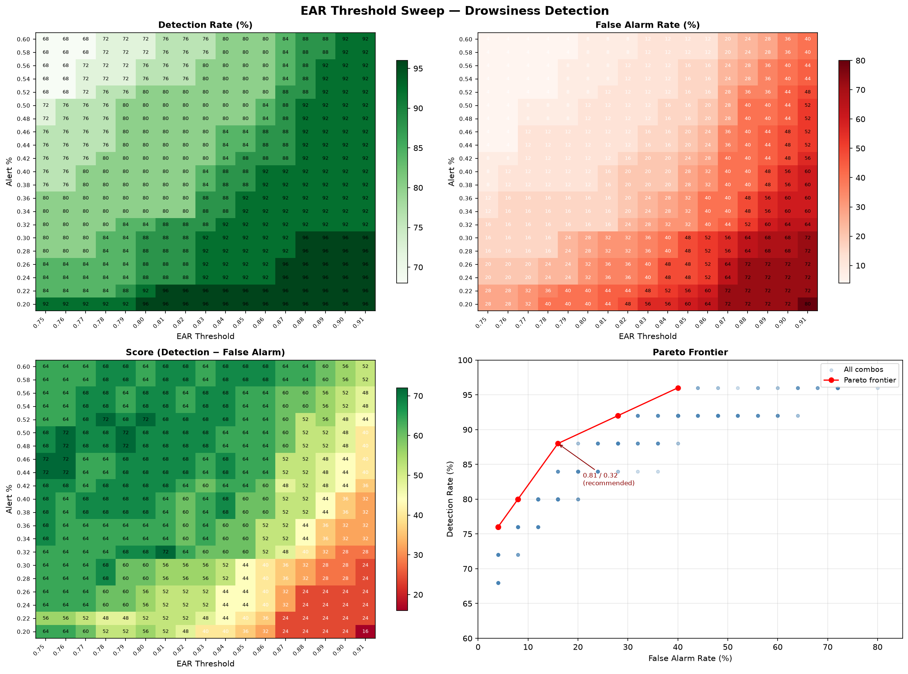
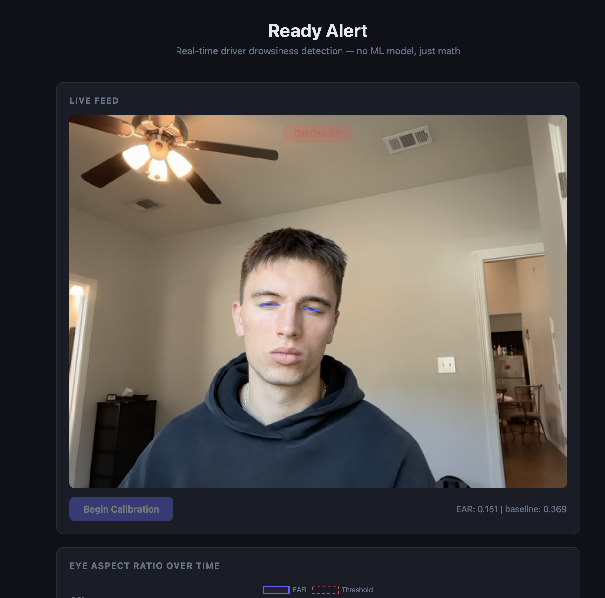

# Ready Alert — Driver Drowsiness Detection

Real-time drowsiness detection that runs in your browser. No ML model needed at inference time — just math.

**[Try it live →](https://YOUR-VERCEL-URL.vercel.app)**

---

## The Story

When we started this project at the 2024 TAMU Datathon, the instinct was to reach for a deep learning model. We explored three approaches before landing on the right one.

### Attempt 1 — Basic CNN on raw face images

The obvious first move: train a convolutional network to classify each frame as "drowsy" or "not drowsy."

The problem surfaced immediately: **how do you label a single frame as drowsy?** Is a person drowsy because their eyes are partially closed in one frame? Or because they've been blinking slowly for the past five seconds? The labeling is fundamentally ambiguous for a single image. The model also had no concept of temporal context.



### Attempt 2 — Custom ResNet50

We built a ResNet50 from scratch (no pretrained weights) hoping a deeper architecture would extract better features. It didn't solve the labeling problem, and training was expensive relative to what we could achieve.

### Attempt 3 — XGBoost on Engineered EAR Features

We shifted to a feature-engineering approach: use dlib's 68-point facial landmark predictor to extract the **Eye Aspect Ratio (EAR)** — a single number that measures how open each eye is — then feed a sliding window of EAR values into a gradient boosting classifier.

This was much better. But it still had two problems:
1. The model was a black box — we couldn't explain *why* a particular window was flagged.
2. It required training data with temporal labels, which we didn't have cleanly.



### Final Approach — Just Use a Threshold

We asked: do we even need a model?

The EAR drops measurably when eyes close. We added one key insight: **personalized calibration**. Instead of using a universal EAR cutoff, each session starts with a 3-second calibration phase where the driver's own alert EAR is measured and used as their personal baseline.

Then we grid-searched two parameters over 25 subjects from the DDD dataset:
- `threshold` — what fraction of a driver's baseline EAR counts as "eyes closing"
- `alert_pct` — what fraction of a 30-frame window must be below threshold to trigger an alert

```
drowsy = (frames_below_threshold / window_size) >= alert_pct
```

No model. No training. No black box. Just transparent, fast, cheap math.

---

## Parameter Sweep Results

Grid search over 16 threshold values (0.75–0.90) × 21 alert percentages (0.20–0.60) across 25 subjects:



**Optimal parameters: `threshold = 0.81`, `alert_pct = 0.32`**

---

## Live App



The browser captures webcam frames and sends them to a Python/dlib backend on Render. The backend extracts the EAR and returns it; the frontend maintains the rolling window and fires the alert. The EAR trace plots in real time alongside your personal threshold line.

---

## Run Locally

```bash
# 1. Download the dlib landmark model (68 MB, not in git)
mkdir -p data
curl -L "https://github.com/davisking/dlib-models/raw/master/shape_predictor_68_face_landmarks.dat.bz2" \
  -o shape_predictor_68_face_landmarks.dat.bz2
bzip2 -d shape_predictor_68_face_landmarks.dat.bz2
mv shape_predictor_68_face_landmarks.dat data/

# 2. Install dependencies
pip install -r requirements.txt

# 3. Run the Flask backend
python live_alert.py
# → open http://localhost:5001 for the original local UI
```

For the web frontend locally, open `web/index.html` in a browser after setting `BACKEND_URL = 'http://localhost:5001'` in the JS.

For notebook exploration (CNN, ResNet, XGBoost):
```bash
pip install -r requirements-dev.txt
jupyter notebook notebooks/
```

---

## Tech Stack

| Layer | Tool |
|-------|------|
| Landmark detection | dlib 68-point predictor |
| Backend | Python / Flask / flask-cors |
| Backend host | Render (free tier) |
| Frontend | Vanilla JS / Chart.js |
| Frontend host | Vercel |
| Exploration | TensorFlow, Keras, scikit-learn, XGBoost |

---

## Dataset

[Driver Drowsiness Dataset (DDD)](https://www.kaggle.com/datasets/ismailnasri20/driver-drowsiness-dataset-ddd) — 41,793 images across multiple subjects, used for parameter sweeping only (not model training).
